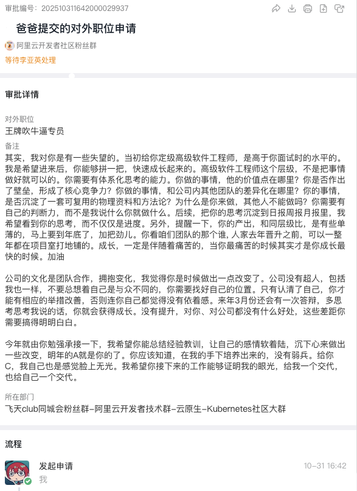

【Cloud Naive Daily Digest 幼稚云技术日报】

1. 申请王牌吹牛逼专员

2. RCU方案：抄作业就要抄两份。先让我同桌抄我这份，再让她帮我抄明天那份
https://mp.weixin.qq.com/s/A-J4YtiCNiNsYLQt_9bUWA?from=groupmessage&scene=1&subscene=318&sessionid=1761872138&clicktime=1761872357&enterid=1761872357&ascene=1&fasttmpl_type=0&fasttmpl_fullversion=7975152-zh_CN-zip&fasttmpl_flag=0&realreporttime=1761872357986

3. 其实，我对你是有一些失望的。当初给你定级开源网关，是高于你立项时的表现的。我是希望你适配kubernetes gatewayAPI之后，你能够拼一把，把dubbo-go-pixiu干下去，快速成长起来的。开源网关这个层级，不是把代码写好就可以的。你需要体系化思考的能力，你们写的代码，他的价值点在哪里？
https://apisix.apache.org/blog/2025/02/17/cloud-vs-open-source-vs-commercial-api-gateways/

Edited today by: Zeusro
Archive of Cloud Naive Daily Digest:
https://github.com/p-program/Cloud-Naive-Daily-Digest/issues/
喜欢的话请直接打钱 ~
If you like it, give it a ⭐️ or watch ~
