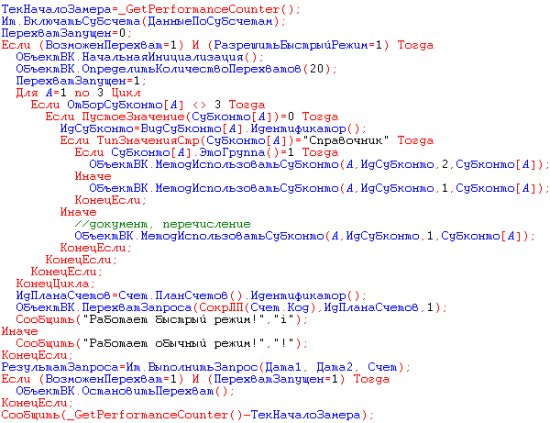

【Cloud Naive Daily Digest 幼稚云技术日报】

1. 兄弟们，该学PHP了
https://mbd.baidu.com/newspage/data/videolanding?nid=sv_4300357672711592814&sourceFrom=share

2. Russian-only programming language了解一下

3. 其实我非常困惑，不知道信息技术行业打工的正确姿势到底是啥？
干得太好，把周围同事都干失业了；
干得稍微有点不好，同事开始挖坑让我跳，上级开始查LOC（lines of code），公司开始查监控以及厕所WiFi的连接情况。
https://mp.weixin.qq.com/s/yVExMIesjJ9GekgbZnsOuw

Edited today by: Zeusro
Archive of Cloud Naive Daily Digest:
https://github.com/p-program/Cloud-Naive-Daily-Digest/issues/
喜欢的话请直接打钱 ~
If you like it, give it a ⭐️ or watch ~
